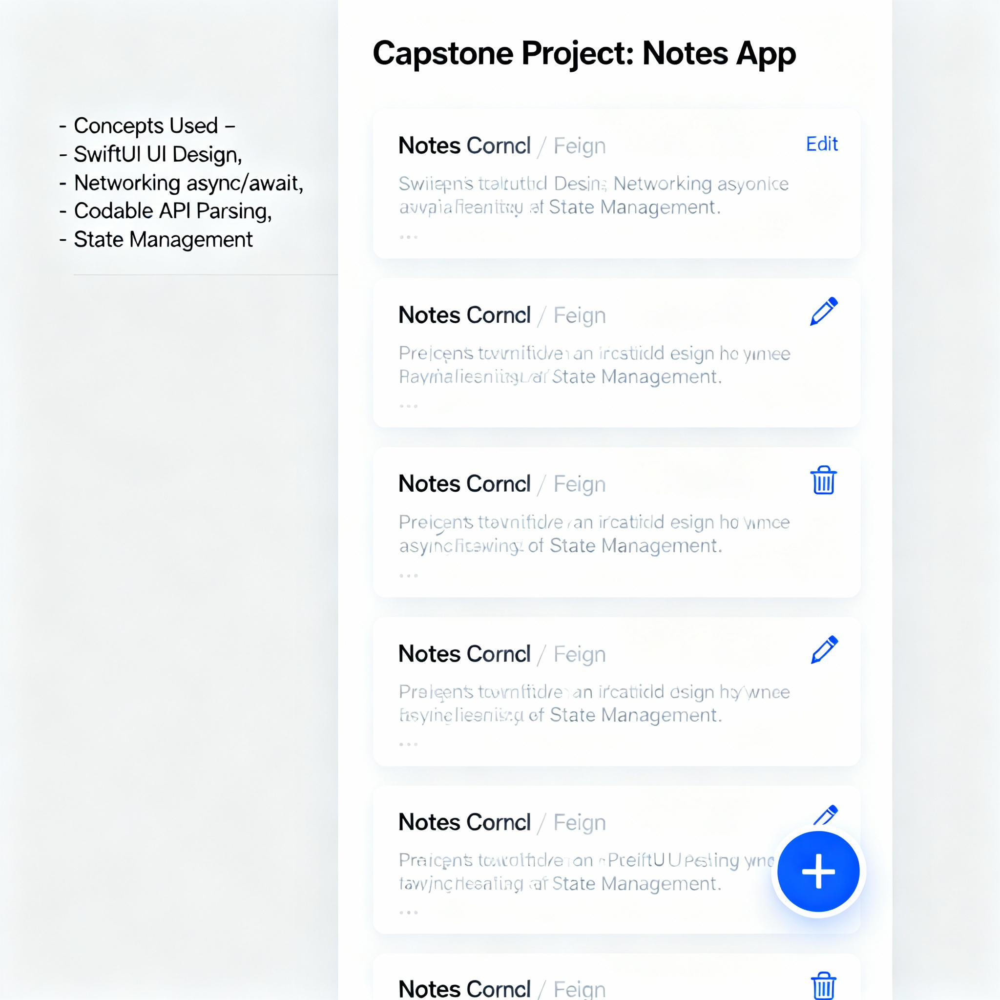

# 🌟 Swift Mini Projects & Capstone Showcase
> A collection of hands-on Swift projects built to master the fundamentals — from console logic to SwiftUI-powered apps.

---

## 📘 Overview

This repository contains a series of **Swift 6.x** projects that demonstrate practical concepts from beginner to intermediate levels — including data types, functions, collections, JSON parsing, async/await networking, and modern SwiftUI UI design.

It’s designed to **bridge the gap between logic-building and app development**, giving learners and developers hands-on exposure to the Swift ecosystem.

---

## 🧰 Tech Stack

- **Language:** Swift 6.1 → 6.2  
- **Tools:** Xcode / Terminal / VS Code / Swift REPL  
- **Frameworks:** SwiftUI, Foundation  
- **Concepts Used:** Codable, async/await, JSON decoding, Optionals, Functions, Error Handling  
- **State Management (UI apps):** @State, @ObservedObject  

---

## ⚙️ Installation & Setup Instructions

### 🖥️ 1. Verify Swift Installation
Check Swift version:

```bash
swift --version
If not installed, download the latest toolchain (Swift 6.2) from
👉 https://swift.org/download

🧱 2. Create Project Directory

mkdir ~/SwiftProjects
cd ~/SwiftProjects

🧩 3. Clone or Copy Files
You can clone this repository or simply copy the .swift files into your directory.

🚀 4. Run Swift Files from Terminal

swift filename.swift
Or compile and run:


swiftc filename.swift -o output && ./output
✅ Works perfectly for all console-based projects.

📱 5. For SwiftUI Projects (Weather & Notes)
You’ll need Xcode (15+ recommended).

Open the .swift file in Xcode

Enable Canvas (⌥ + ⌘ + ↩)

Click Resume to preview

Export preview image from Canvas → “Export Preview as Image”

🧩 Project List
🧮 1. Simple Calculator (calculator.swift)
Concepts: Functions, Conditionals, Switch Cases
A basic console calculator that performs addition, subtraction, multiplication, and division — with error handling for invalid input.

Run:


swift calculator.swift
✅ 2. To-Do List App (todo.swift)
Concepts: Arrays, Loops, Functions, Optionals
A command-line task tracker where users can add, view, and remove tasks dynamically.

Run:


swift todo.swift
Highlights:

Uses arrays to manage data

Simple menu-driven console interface

Safe input & validation

📄 3. JSON Data Parser (json_parser.swift)
Concepts: Codable, JSONDecoder, File Handling
Demonstrates how to parse JSON data using Swift’s native Codable protocol — essential for modern API handling.

Run:


swift json_parser.swift
Code Snippet:


struct User: Codable {
    let name: String
    let age: Int
}
let data = try JSONDecoder().decode(User.self, from: jsonData)
🌤️ 4. Weather App (weather.swift)
Concepts: Networking (async/await), Codable, JSON Parsing
Fetches live weather data (temperature, wind speed, etc.) from the Open-Meteo API and prints results neatly in the console.

Run:


swiftc -parse-as-library weather.swift -o weather && ./weather
Output Example:


🌦️ City: New Delhi
Temperature: 28.4°C
Wind Speed: 3.9m/s
Weather Code: 1
🧪 5. Test Script (test.swift)
Concepts: Experimentation, Syntax Validation
A testing playground file to experiment with small Swift snippets, test APIs, or validate functions during development.

Run:


swift test.swift
Use it as your Swift scratchpad — ideal for trying new logic before integrating it into other projects.

🗒️ 6. Notes App (SwiftUI)
Concepts: SwiftUI, CRUD, State Management
Create, edit, and delete personal notes using SwiftUI’s reactive design. Works offline using mock data for previews.

Preview:


Highlights:

Built using SwiftUI

Uses @State and @ObservedObject

Works in Xcode Preview mode (no API needed)

🌦️ 7. Weather App (SwiftUI)
Concepts: SwiftUI, Networking (async/await), Codable
Displays live temperature and weather details fetched via API — rendered beautifully using SwiftUI’s declarative UI.

Preview:


Highlights:

Uses Open-Meteo API

Async/await for non-blocking fetch

Live mock data preview available offline

📂 Repository Structure

swift-mini-projects/
│
├── calculator.swift
├── todo.swift
├── json_parser.swift
├── weather.swift
├── test.swift
│
├── resources/
│       ├── notes_app.png
│       └── weather_app.png
│
└── README.md

🧠 Learning Outcomes
By exploring these projects, you’ll:

Master Swift syntax and standard library

Implement optionals, closures, functions, and collections

Handle JSON data and APIs gracefully

Build and preview SwiftUI apps locally

Transition from console apps → iOS-ready SwiftUI apps

💡 Did You Know?
The first version of Apple’s Reminders app was built using arrays and dictionaries — just like your To-Do List.

Swift’s Codable protocol replaced hundreds of lines of manual JSON parsing.

SwiftUI lets you preview UI without compiling the whole app — perfect for iterative design.

🚀 Future Enhancements
Add CoreData for persistence

Add real-time weather icons and conditions

Expand Notes app with folder view and search

Create a combined dashboard showing weather + notes
